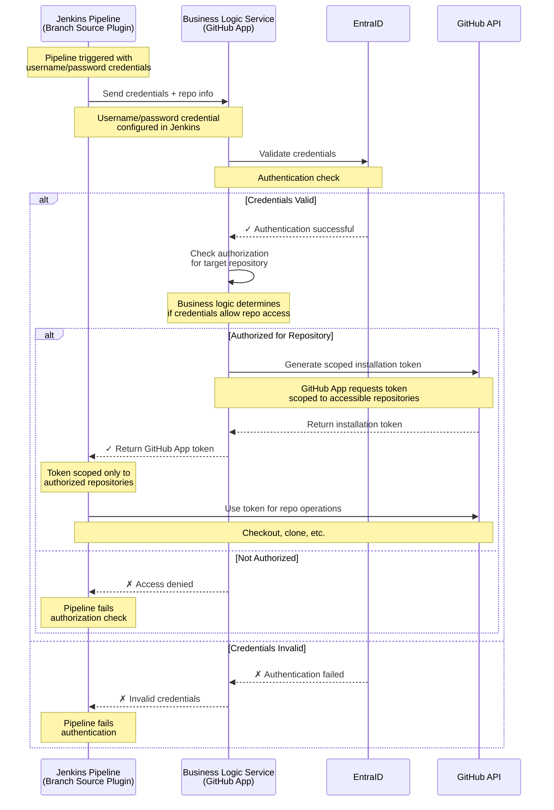

# Jenkins Pipeline Credential Flow Diagram

## Flow Description

1. **Jenkins Pipeline Start**: Pipeline configured with branch source plugin and username/password credentials
2. **Credential Submission**: Jenkins sends credentials along with repository information to the business logic service (GitHub App)
3. **Authentication**: Business logic service validates credentials against EntraID
4. **Authorization Check**: If authenticated, the service checks if credentials are authorized for the target repository
5. **Token Generation**: If authorized, the GitHub App component directly requests a scoped installation token from GitHub API
6. **Token Return**: GitHub API returns the scoped token to the business logic service, which forwards it to Jenkins
7. **Repository Access**: Jenkins uses the scoped token for repository operations
